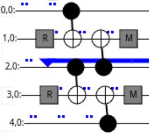
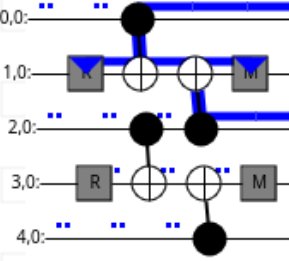
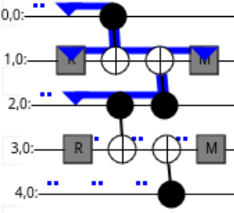

Automatic detector finding
==========================

The ``tqecd`` package implements a method to automatically find detectors from a
given quantum circuit representing a quantum error corrected computation.

An accompanying notebook showcasing the different steps to find detectors is located
`here <../media/detectors/detector_finding_illustration.ipynb>`_.

Concepts used through the package
~~~~~~~~~~~~~~~~~~~~~~~~~~~~~~~~~

A few core concepts are re-used through the whole ``tqecd`` package. This section aims at
presenting these core concepts in an accessible manner.

Terms that are conventionally used in quantum computing, such as "circuit", will not
be defined here.

.. _moments-section:

Moments
^^^^^^^

The concept of "moment" is central to ``tqecd``. A "moment" is a portion of a
quantum circuit that is located between two ``TICK`` instructions. Conventionally,
moments may end with a ``TICK`` instruction, but do not start with one.

This definition is close, but not equivalent, to the definition used by ``cirq``. One of
the main difference is that ``cirq`` defines a moment as a sub-circuit of depth 1: no
instruction in the moment overlaps with another instruction in the same moment.
In the definition given above, there is no notion of depth, and even though ``TICK``
instruction are generally used in ``stim`` to denote the passage of time such as the moment definition above
is equivalent to the definition used by ``cirq``, this is not required.

For example, the circuit

.. code-block::

    R 0 1 2 3 4
    TICK
    CX 0 1 2 3
    TICK
    CX 2 1 4 3
    TICK
    M 1 3
    DETECTOR(1, 0) rec[-2]
    DETECTOR(3, 0) rec[-1]
    M 0 2 4
    DETECTOR(1, 1) rec[-2] rec[-3] rec[-5]
    DETECTOR(3, 1) rec[-1] rec[-2] rec[-4]
    OBSERVABLE_INCLUDE(0) rec[-1]

contains 4 moments.

Fragments
^^^^^^^^^

Fragments are a collection of moments that check the following order:

1. zero or more moments composed of `reset` and any other instructions except measurement instructions,
2. zero or more moments composed of "computation" instructions (anything that is not a measurement or a reset),
3. one moment composed of `measurement` and any other instructions except reset instructions.

The circuit provided in :ref:`moments-section` contains 4 moments that form
a fragment.

Note that the circuit

.. code-block::

    M 1 3
    DETECTOR(1, 0) rec[-2]
    DETECTOR(3, 0) rec[-1]
    M 0 2 4
    DETECTOR(1, 1) rec[-2] rec[-3] rec[-5]
    DETECTOR(3, 1) rec[-1] rec[-2] rec[-4]
    OBSERVABLE_INCLUDE(0) rec[-1]

also form a fragment!

Flows
^^^^^

Stabilizers can propagate through a fragment, but can also be created or destroyed by it.

Let's use the following quantum circuit to illustrate:

.. code-block::

    R 1 3
    TICK
    CX 0 1 2 3
    TICK
    CX 2 1 4 3
    TICK
    M 1 3

You can also `check it interactively using crumble <https://algassert.com/crumble#circuit=Q(0,0)0;Q(1,0)1;Q(2,0)2;Q(3,0)3;Q(4,0)4;R_1_3;TICK;CX_0_1_2_3;TICK;CX_2_1_4_3;TICK;M_1_3;DT(1,0,0)rec[-2];DT(3,0,0)rec[-1]_rec[-2];DT(3,0,1)rec[-1]/>`_.

This quantum circuit can "propagate" a stabilizer, for example if a ``Z`` stabilizer
on qubit ``2`` is given as input, a ``Z`` stabilizer on qubit ``2`` is propagated
through:

The quantum circuit also "creates" propagation of stabilizers with its resets, as
shown in the illustration below:

Here, the fragment is creating a ``Z0Z2`` stabilizer: the ``Z`` Pauli string
comes out of the final moment of the fragment on qubits ``0`` and ``2``.

Quantum circuit can also "destroy" some incoming stabilizers with its measurements
as shown below:

Here, the fragment is destroying an incoming ``Z0Z2`` stabilizer.

These three kinds of stabilizer propagation are "flows". A "flow" is describing the
way a stabilizer propagates through a fragment.

Collapsing operations
^^^^^^^^^^^^^^^^^^^^^

Collapsing operations are operations that are involved in the collapsing
(i.e., "destruction") or "creation" of flows.

Measurements and resets are the only collapsing operations.

Note that, by construction, collapsing operations can only be encountered at the
boundaries (beginning/end) of a fragment.

Boundary stabilizers
^^^^^^^^^^^^^^^^^^^^

An important data-structure used in the package is ``BoundaryStabilizer``. This
data-structure represents the state of a flow at the boundaries of a fragment.
It stores:

1. a Pauli string, representing the state of a flow that propagated from one boundary,
   just before encountering the collapsing operations of the other boundary,
2. a list of Pauli strings, each representing one of the collapsing operations that
   will be encountered by the propagated Pauli string,
3. a list of measurements that are involved (either as sources for a destruction flow
   or as sinks for a creation flow) in the flow propagation and that will be used later
   to know which measurements to include in the detectors.

Taking the above example, the following flow:

can be represented by a ``BoundaryStabilizer`` instance with the following attributes:

1. ``Z0Z1Z2`` for the stabilizer, as before encountering the measurement, the propagated
   stabilizer is ``Z0Z1Z2``.
2. ``[Z1, Z3]`` as collapsing operations, as the measurements present in the above circuit
   are performed in the ``Z`` basis, and on qubits ``1`` and ``3``.
3. a data-structure that will represent the measurement performed on qubit ``1``, as the
   only measurement that is taking part in the stabilizer propagation is this one.

As another example, the following flow:

can be represented by a ``BoundaryStabilizer`` instance that has exactly the same attributes
as the one described above.

To distinguish between these two ``BoundaryStabilizer`` (one representing a creation flow,
the other representing a destruction flow), they will be stored in a data-structure that
will differentiate creation and destruction flows: ``FragmentFlow`` (or ``FragmentLoopFlow``).

How detectors are found
~~~~~~~~~~~~~~~~~~~~~~~

:py:func:`~tqecd.construction.annotate_detectors_automatically` finds detectors by
*flow matching*, in this order.

1. The flows of every fragment are built.
2. Inside each fragment, non-trivial flows that are fully collapsed within that fragment
   give a detector directly, without any cover search.
3. Each pair of adjacent fragments goes through ``match_boundary_stabilizers``. A
   ``REPEAT`` block counts as one unit in the pairing. Its destruction flows are those of
   its first body fragment and its creation flows are those of its last.

   a. Flows that anticommute with their collapsing operations are merged on each side
      into commuting ones, using a minimal commuting cover (see below).
   b. A creation flow of the left fragment is matched one-to-one with a destruction flow
      of the right fragment when they are equal after the collapsing operations. Flows
      with anticommuting operations are skipped.
   c. The remaining flows are matched by an exact cover
      (:py:func:`~tqecd.cover.find_exact_cover`) in both directions. Left creation flows
      are covered by right destruction flows, then right destruction flows by left
      creation flows. This step is skipped when either side has no flow left, or when
      both sides have exactly one. The measurements of the detector are the union of the
      target's measurements and the symmetric difference of the cover's measurements.

.. _minimal-commuting-cover:

Minimal commuting cover
^^^^^^^^^^^^^^^^^^^^^^^

A boundary stabilizer can anticommute with the collapsing operations on the other side of
its fragment, for example a ``Z`` stabilizer that meets a ``Y`` measurement. Several such
stabilizers are then multiplied together so that the product commutes with the collapsing
operations. :py:func:`~tqecd.cover.find_commuting_cover_on_target_qubits` returns the
fewest of them. Using more than needed removes flows that other detectors could have used.

Take collapsing operations ``Y0*Y1*Y2`` and four boundary stabilizers.

.. code-block:: python

    import stim

    from tqecd.cover import find_commuting_cover_on_target_qubits
    from tqecd.pauli import PauliString, pauli_product

    def pauli(text: str) -> PauliString:
        return PauliString.from_stim_pauli_string(stim.PauliString(text))

    target = pauli("YYY")
    sources = [pauli("_XZ"), pauli("Z__"), pauli("ZZZ"), pauli("ZXZ")]
    cover = find_commuting_cover_on_target_qubits(target, sources)
    print(cover)
    print(pauli_product([sources[i] for i in cover]))

.. code-block:: text

    [2, 3]
    Y1

``Z0*Z1*Z2`` and ``Z0*X1*Z2`` both anticommute with ``Y0*Y1*Y2`` on all three qubits,
and their product ``Y1`` commutes with it. A single elimination pass would have used the
first three stabilizers instead. The search is exact when the null space of the
anticommutation vectors is small and falls back to a heuristic above that size, which may
return a cover that is not the smallest. The details are in the docstring of the function.

Unrolled fallback
^^^^^^^^^^^^^^^^^

A detector placed inside a ``REPEAT`` body must be valid for every iteration. When a loop
repeats more than once, the matcher checks that the detectors between the last and the
first fragment of the body equal those between the previous fragment and the loop, and
raises ``TQECDException`` otherwise. When a ``TQECDException`` is raised on a circuit
that contains a loop, the circuit is unrolled and the same flow matching is run on it.
Unrolling expands every ``REPEAT`` block and inserts a ``TICK`` where one is missing, at
the boundaries between loop copies and between a loop and its neighbouring instructions.
The result has no ``REPEAT`` block, so its size grows with the number of repetitions. If
the unrolled circuit does not satisfy the input requirements, the original exception is
re-raised.

Example
~~~~~~~

See the accompanying notebook for an example of how to perform automatic detector computation:

.. toctree::
   :maxdepth: 1

   ../media/detectors/detector_finding_illustration.ipynb
