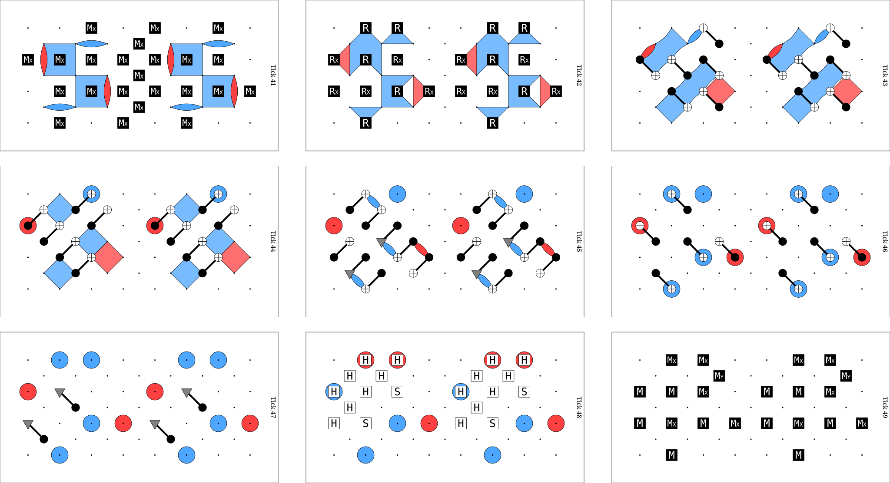
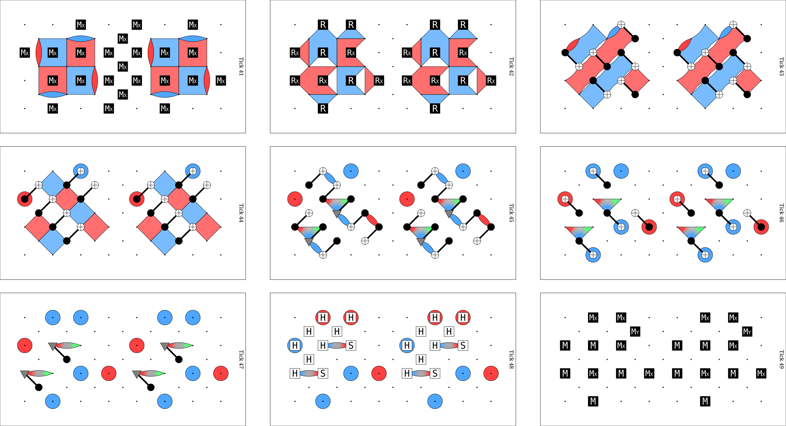

How detectors are found
=======================

A detector is a set of measurements whose combined parity is deterministic when the
circuit has no noise. :py:func:`~tqecd.construction.annotate_detectors_automatically`
finds detectors by *flow matching*. This page uses the terms of :doc:`basic_concepts`:
fragments, flows, collapsing operations and boundary stabilizers.

Commuting and anticommuting flows
~~~~~~~~~~~~~~~~~~~~~~~~~~~~~~~~~

Each flow is stored as a :py:class:`~tqecd.boundary.BoundaryStabilizer`. Its Pauli
string is the stabilizer at one boundary of a fragment, before the collapsing operations
of that boundary.

- A creation flow starts at a reset of the fragment and propagates forward. Its
  collapsing operations are the measurements of the fragment.
- A destruction flow starts at a measurement of the fragment and propagates backward.
  Its collapsing operations are the resets of the fragment.

A flow *commutes* when its Pauli string commutes with each of its collapsing operations.
Then the collapse is defined: the Pauli string without the qubits of the collapsing
operations (:py:attr:`~tqecd.boundary.BoundaryStabilizer.after_collapse`) is the part
of the flow that crosses the boundary. A flow *anticommutes* when its Pauli string
anticommutes with at least one collapsing operation
(:py:attr:`~tqecd.boundary.BoundaryStabilizer.has_anticommuting_operations`). For
example, a creation flow ``Z0`` that meets an ``MX 0`` or an ``MY 0`` measurement
anticommutes. That measurement removes ``Z0`` from the stabilizers of the state, so
the flow alone cannot cross the boundary. A product of anticommuting flows can commute
with every collapsing operation, and that product crosses the boundary.

Covers
~~~~~~

A *cover* of a Pauli string ``target`` by a list of Pauli strings ``sources`` is a list
of indices into ``sources``. The functions in :py:mod:`tqecd.cover` return two kinds.
Pauli strings in ``tqecd`` have no sign, so all products below ignore the sign.

- An *exact cover* (:py:func:`~tqecd.cover.find_exact_cover`): the product of the
  selected sources equals ``target`` on every qubit.
- A *commuting cover* (:py:func:`~tqecd.cover.find_commuting_cover_on_target_qubits`):
  on every qubit where ``target`` is not the identity, the product of the selected
  sources commutes with the Pauli of ``target`` on that qubit. On the other qubits, the
  product can be any Pauli.

For a commuting cover, ``target`` is the product of the collapsing operations of a
boundary. These operations act on one qubit each, so the product of a commuting cover
commutes with every collapsing operation. Both functions encode each source as a bit
vector and solve a linear system over GF(2). For an exact cover, the vector holds the
``X`` and ``Z`` bits of each qubit. For a commuting cover, it holds one bit per qubit of
``target``, set when the source anticommutes with ``target`` on that qubit.

Flow matching
~~~~~~~~~~~~~

The steps below are done in this order.

1. The flows of every fragment are built.
2. Inside each fragment, a non-trivial commuting flow whose Pauli string is the identity
   after the collapse gives a detector directly, without any cover search.
3. Each pair of adjacent fragments goes through
   :py:func:`~tqecd.match.match_boundary_stabilizers`. A ``REPEAT`` block counts as one
   unit in the pairing. Its destruction flows are those of its first body fragment and
   its creation flows are those of its last.

   a. On each side, the anticommuting flows are merged into commuting flows. All
      anticommuting flows of one side must have the same collapsing operations. The
      merge finds a minimal commuting cover of the product of these operations by the
      Pauli strings of the anticommuting flows (see below). It replaces the flows of
      the cover by one flow: the product of their Pauli strings, with their
      measurements combined (:py:meth:`~tqecd.boundary.BoundaryStabilizer.merge`).
      The merge repeats until no commuting cover is left.
   b. A creation flow of the left fragment is matched one-to-one with a destruction
      flow of the right fragment when they are equal after the collapsing operations.
      The two flows give one detector. Anticommuting flows are skipped.
   c. The remaining flows are matched by an exact cover in both directions. Left
      creation flows are covered by right destruction flows, then right destruction
      flows by left creation flows. This step is skipped when either side has no flow
      left, or when both sides have exactly one. The measurements of the detector are
      the union of the target's measurements and the symmetric difference of the
      cover's measurements.

.. _minimal-commuting-cover:

Minimal commuting cover
~~~~~~~~~~~~~~~~~~~~~~~

The merge of step 3a uses
:py:func:`~tqecd.cover.find_commuting_cover_on_target_qubits`, which returns a commuting
cover with the fewest sources. A larger cover merges flows that are not needed, and
these flows are then not available to other detectors.

Take collapsing operations ``Y0*Y1*Y2`` and four anticommuting flows.

.. code-block:: python

    import stim

    from tqecd.cover import find_commuting_cover_on_target_qubits
    from tqecd.pauli import PauliString, pauli_product

    def pauli(text: str) -> PauliString:
        return PauliString.from_stim_pauli_string(stim.PauliString(text))

    target = pauli("YYY")
    sources = [pauli("_XZ"), pauli("Z__"), pauli("ZZZ"), pauli("ZXZ")]
    cover = find_commuting_cover_on_target_qubits(target, sources)
    print(cover)
    print(pauli_product([sources[i] for i in cover]))

.. code-block:: text

    [2, 3]
    Y1

``Z0*Z1*Z2`` and ``Z0*X1*Z2`` both anticommute with ``Y0*Y1*Y2`` on all three qubits,
and their product ``Y1`` commutes with it. A single elimination pass would have used the
first three stabilizers instead. The search is exact when the null space of the
anticommutation vectors is small and falls back to a heuristic above that size, which may
return a cover that is not the smallest. The details are in the docstring of the function.

Y-basis transition round
~~~~~~~~~~~~~~~~~~~~~~~~

A Y half cube uses the in-place Y-basis construction of Gidney [Gidney2024]_. A single
transition round changes the boundaries of the patch from XZXZ to XXZZ. This maps the Y
observable to a known product of stabilizers, and the stabilizer rounds after it measure
that product again and again. The paper states:

    By repeatedly measuring the stabilizers of the patch, you learn this product to
    arbitrarily high certainty… it's sufficient to measure these stabilizers d/2
    times.

The circuits of the paper are in its data record [GidneyData2022]_. The transition round
contains ``CY`` gates, ``S`` gates and ``MY`` measurements. Near this round, some flows
anticommute with their collapsing operations, for example with the ``MY`` measurements,
and ``tqecd`` merges them with commuting covers.

To see how the minimal commuting cover handles the transition round of a Y half cube,
see `tqecd pull request #74 <https://github.com/tqec/tqecd/pull/74>`_.

The two figures show the detecting regions in the transition round (ticks 41 to 49) of
the ``s_gate_x`` circuit of ``tqec`` at ``k=1``
(:download:`circuit <../media/detectors/s_gate_x_k1_no_detectors.stim>`). Red regions
are ``X`` type and blue regions are ``Z`` type.

   Annotation by ``tqecd`` 0.2.1.

   Annotation with the minimal commuting cover. Four more red regions are present
   around the ``S`` gates.

Unrolled fallback
~~~~~~~~~~~~~~~~~

A detector placed inside a ``REPEAT`` body must be valid for every iteration. When a loop
repeats more than once, the matcher checks that the detectors between the last and the
first fragment of the body equal those between the previous fragment and the loop, and
raises ``TQECDException`` otherwise. When a ``TQECDException`` is raised on a circuit
that contains a loop, the circuit is unrolled and the same flow matching is run on it.
Unrolling expands every ``REPEAT`` block and inserts a ``TICK`` where one is missing, at
the boundaries between loop copies and between a loop and its neighbouring instructions.
The result has no ``REPEAT`` block, so its size grows with the number of repetitions. If
the unrolled circuit does not satisfy the input requirements, the original exception is
re-raised.

References
~~~~~~~~~~

.. [Gidney2024] C. Gidney, "Inplace Access to the Surface Code Y Basis", Quantum 8,
   1310 (2024). https://doi.org/10.22331/q-2024-04-08-1310, arXiv:2302.07395.

.. [GidneyData2022] C. Gidney, Data for "Inplace Access to the Surface Code Y Basis",
   Zenodo (2022). https://doi.org/10.5281/zenodo.7487893
